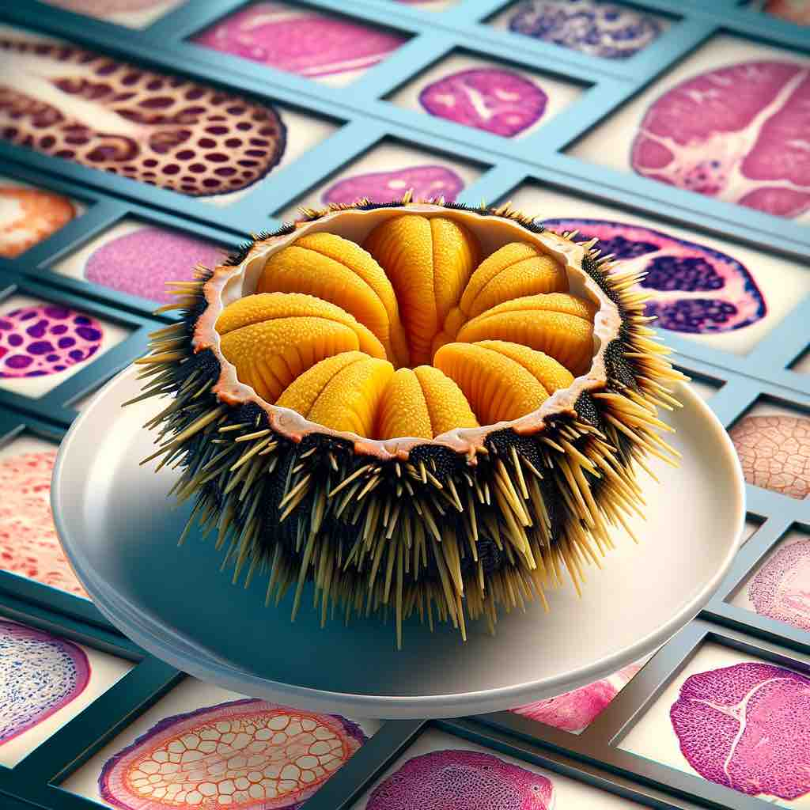
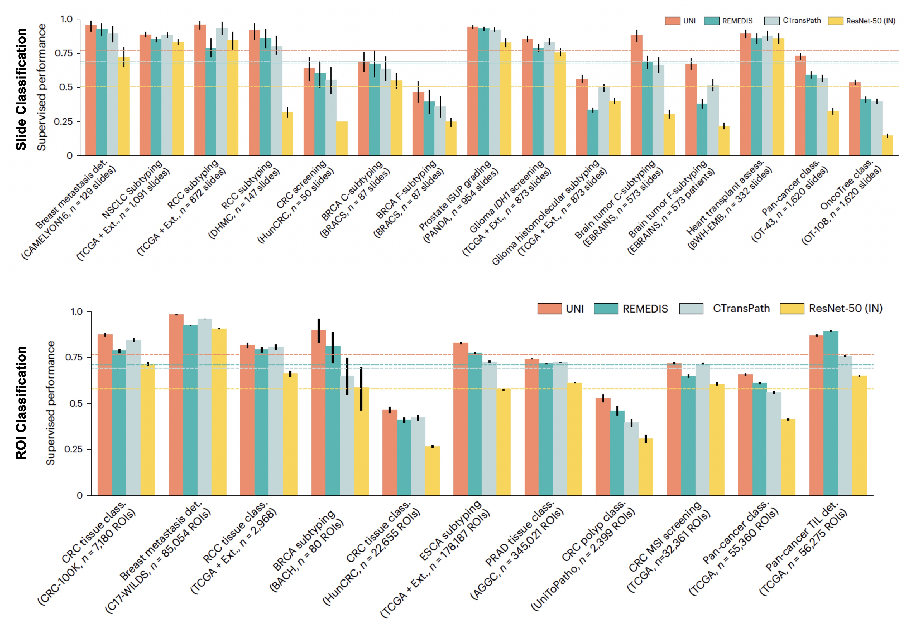

# UNI 

## Towards a General-Purpose Foundation Model for Computational Pathology
*Nature Medicine* 

 [Journal Link](https://www.nature.com/articles/s41591-024-02857-3) | [Open Access Read Link](https://rdcu.be/dBMgh) | [Download Model](https://huggingface.co/MahmoodLab/uni) | [Cite](#reference) 
 
**Abstract:** Quantitative evaluation of tissue images is crucial for computational pathology (CPath) tasks, requiring the objective characterization of histopathological entities from whole-slide images (WSIs). The high resolution of WSIs and the variability of morphological features present significant challenges, complicating the large-scale annotation of data for high-performance applications. To address this challenge, current efforts have proposed the use of pretrained image encoders through transfer learning from natural image datasets or self-supervised learning on publicly available histopathology datasets, but have not been extensively developed and evaluated across diverse tissue types at scale. We introduce UNI, a general-purpose self-supervised model for pathology, pretrained using more than 100 million images from over 100,000 diagnostic H&E-stained WSIs (>77 TB of data) across 20 major tissue types. The model was evaluated on 34 representative CPath tasks of varying diagnostic difficulty. In addition to outperforming previous state-of-the-art models, we demonstrate new modeling capabilities in CPath such as resolution-agnostic tissue classification, slide classification using few-shot class prototypes, and disease subtyping generalization in classifying up to 108 cancer types in the OncoTree classification system. UNI advances unsupervised representation learning at scale in CPath in terms of both pretraining data and downstream evaluation, enabling data-efficient artificial intelligence models that can generalize and transfer to a wide range of diagnostically challenging tasks and clinical workflows in anatomic pathology.

## What is UNI?

UNI is the largest pretrained vision encoder for histopathology (100M images, 100K WSIs) _**developed on internal neoplastic, infectious, inflamatory and normal tissue and also made publicly available**_. We show state-of-the-art performance across 34 clinical tasks, with strong performance gains on rare and underrepresented cancer types.
 - _**Why use UNI?**_: UNI does not use open datasets and large public histology slide collections (TCGA, CPTAC, PAIP, CAMELYON, PANDA, and others in TCIA) for pretraining, which are routinely used in benchmark development in computational pathology. We make UNI available for the research community in building and evaluating pathology AI models without risk of data contamination on public benchmarks or private histopathology slide collections.

## Updates

- **07/16/2024**: Included comparisons with [Virchow](https://github.com/mahmoodlab/UNI?tab=readme-ov-file#slide-benchmarks).
- **06/15/2024**: Included comparisons with [Prov-GigaPath](https://github.com/mahmoodlab/UNI?tab=readme-ov-file#slide-benchmarks).

## Installation
First clone the repo and cd into the directory:
```shell
git clone https://github.com/mahmoodlab/UNI.git
cd UNI
```
Then create a conda env and install the dependencies:
```shell
conda create -n UNI python=3.10 -y
conda activate UNI
pip install --upgrade pip  # enable PEP 660 support
pip install -e .
```


### 1. Getting access
Request access to the model weights from the Huggingface model page at: [https://huggingface.co/mahmoodlab/UNI](https://huggingface.co/mahmoodlab/uni).

### 2. Downloading weights + Creating model
Following authentication (using ```huggingface_hub```), the ViT-L/16 model architecture with pretrained weights and image transforms for UNI can be directly loaded using the [timm](https://huggingface.co//github/hub/en/timm) library. This method automatically downloads the model weights to the [huggingface_hub cache](https://huggingface.co//github/huggingface_hub/en/guides/manage-cache) in your home directory (```~/.cache/huggingface/hub/models--MahmoodLab--UNI```), which ```timm``` will automatically find when using the commands below:

```python
import timm
from timm.data import resolve_data_config
from timm.data.transforms_factory import create_transform
from huggingface_hub import login

login()  # login with your User Access Token, found at https://huggingface.co/settings/tokens

# pretrained=True needed to load UNI weights (and download weights for the first time)
# init_values need to be passed in to successfully load LayerScale parameters (e.g. - block.0.ls1.gamma)
model = timm.create_model("hf-hub:MahmoodLab/UNI", pretrained=True, init_values=1e-5, dynamic_img_size=True)
transform = create_transform(**resolve_data_config(model.pretrained_cfg, model=model))
model.eval()
```

You can also download the model weights to a specified checkpoint location in your local directory. The ```timm``` library is still used for defining the ViT-L/16 model architecture. Pretrained weights and image transforms for UNI need to be manually loaded and defined.
```python
import os
import torch
from torchvision import transforms
import timm
from huggingface_hub import login, hf_hub_download

login()  # login with your User Access Token, found at https://huggingface.co/settings/tokens

local_dir = "../assets/ckpts/vit_large_patch16_224.dinov2.uni_mass100k/"
os.makedirs(local_dir, exist_ok=True)  # create directory if it does not exist
hf_hub_download("MahmoodLab/UNI", filename="pytorch_model.bin", local_dir=local_dir, force_download=True)
model = timm.create_model(
    "vit_large_patch16_224", img_size=224, patch_size=16, init_values=1e-5, num_classes=0, dynamic_img_size=True
)
model.load_state_dict(torch.load(os.path.join(local_dir, "pytorch_model.bin"), map_location="cpu"), strict=True)
transform = transforms.Compose(
    [
        transforms.Resize(224),
        transforms.ToTensor(),
        transforms.Normalize(mean=(0.485, 0.456, 0.406), std=(0.229, 0.224, 0.225)),
    ]
)
model.eval()
```

The function `get_encoder` performs the commands above, downloading in the checkpoint in the `./assets/ckpts/` relative path of this GitHub repository.
```python
from uni import get_encoder
model, transform = get_encoder(enc_name='uni', device=device)
```

### 3. Running Inference

You can use the UNI pretrained encoder to extract features from histopathology ROIs, as follows:

```python
from PIL import Image
image = Image.open("uni.jpg")
image = transform(image).unsqueeze(dim=0) # Image (torch.Tensor) with shape [1, 3, 224, 224] following image resizing and normalization (ImageNet parameters)
with torch.inference_mode():
    feature_emb = model(image) # Extracted features (torch.Tensor) with shape [1,1024]
```

These pre-extracted features can then be used ROI classification (via linear probing), slide classification (via multiple instance learning), and other machine learning settings.


## Overview of specific usages
We provide high-level functions for loading the model and using it for inference. For model loading, the function `get_encoder` performs the commands above in Step 2, downloading in the checkpoint in the `./assets/ckpts/` relative path of this GitHub repository.
```python
from uni import get_encoder
model, transform = get_encoder(enc_name='uni', device=device)
```

For inference:
```python
from uni.downstream.extract_patch_features import extract_patch_features_from_dataloader
from uni.downstream.eval_patch_features.linear_probe import eval_linear_probe
from uni.downstream.eval_patch_features.fewshot import eval_knn, eval_fewshot
from uni.downstream.eval_patch_features.protonet import ProtoNet, prototype_topk_vote
```
Refer to the notebooks below for detailed examples.

### More detailed starter code for loading / using the model:
See [**./notebooks/uni_walkthrough.ipynb**](notebooks/uni_walkthrough.ipynb) to get started with loading and using the model to create embeddings, and example code for extracting ROI features and performing ROI classification / retrieval.

## Comparisons & Additional Benchmarks 

<div align="center">
  
</div>


A detailed set of benchmarks are in the paper [[1]](https://www.nature.com/articles/s41591-024-02857-3) (also shown above). Some models were released after our study was in review. For a more comprehensive comparison, we have provided additional results on EBRAINS, PANDA, OncoTree, IHC ER / PR assessment, CRC-100K-Raw, and TCGA Uniform Tumor datasets as a representative set of benchmarks which cover a wide range of tissue types, diseases, difficulty levels (up to 108-classes) and staining (H&E and IHC). Results are reported using ABMIL and KNN (K=20) slide and ROI tasks respectively.

Please refer to the UNI [[1]](https://www.nature.com/articles/s41591-024-02857-3) and CONCH [[2]](https://www.nature.com/articles/s41591-024-02856-4) papers for more detailed benchmarking.

### Slide Benchmarks
| Model name     | Pretraining       |   EBRAINS-C (12 classes, Public)       |   EBRAINS-F (30 classes, Public)     |   PANDA (5 classes, Public) |   OncoTree-108 (108 classes, Internal) |   IHC ER / PR Assess. (6 classes, Internal)  |
|:---------------|:------------------|---------------------------:|-------------------------:|-----------------:|------------------:|---------------------------:|
|  |  | Balanced acc. | Balanced acc. | Quadratic-weight $\kappa$ | Balanced acc. | Quadratic-weight $\kappa$ |
| **UNI** [[1]](https://www.nature.com/articles/s41591-024-02857-3)            | Vision  |                      **0.883** |                    0.675 |            <ins>0.946</ins> |             **0.538** |     0.785 |
| **CONCH** [[2]](https://www.nature.com/articles/s41591-024-02856-4)         | Vision-language   |                      0.868 |                    **0.689** |            0.934 |             0.515 |       <ins>0.819</ins> |
| Virchow (CLS+MEAN) [[3]](https://arxiv.org/pdf/2309.07778)            | Vision  |                      0.833 |                    0.654 |            0.943 |             0.519 |     0.788 |
| Prov-GigaPath [[4]](https://www.nature.com/articles/s41586-024-07441-w)            | Vision  |                      <ins>0.875</ins> |                    <ins>0.687</ins> |            0.942 |             <ins>0.522</ins> |     **0.821** |
| Phikon [[5]](https://doi.org/10.1101/2023.07.21.23292757)         | Vision   |                      0.810  |                    0.659 |            **0.950**  |             0.486 |                      0.744 |  
| REMEDIS [[6]](https://doi.org/10.1038/s41551-023-01049-7)     | Vision   |                      0.687 |                    0.382 |            0.932 |             0.412 |                      0.762 |   
| CTransPath [[7]](https://doi.org/10.1016/j.media.2022.102559)     | Vision   |                      0.666 |                    0.514 |            0.927 |             0.399 |                      0.786 | 
| Quilt-Net [[8]](https://proceedings.neurips.cc/paper_files/paper/2023/file/775ec578876fa6812c062644964b9870-Paper-Datasets_and_Benchmarks.pdf)          | Vision-language   |                      0.728 |                    0.608 |            0.909 |             0.389 |                      0.784 | 
| PLIP [[9]](https://doi.org/10.1038/s41591-023-02504-3)           | Vision-language   |                      0.683 |                    0.562 |            0.901 |             0.369 |                      0.759 | 
| ResNet-50 (Tr) [[10]](https://openaccess.thecvf.com/content_cvpr_2016/papers/He_Deep_Residual_Learning_CVPR_2016_paper.pdf) | ImageNet Transfer |                      0.302 |                    0.219 |            0.831 |             0.148 |                      0.709 |

### ROI Benchmarks
| Model name     | Pretraining       |   CRC-100K-Raw (9 classes, Public)           |  TCGA Uniform Tumor (32 classes, Public)      |
|:---------------|:------------------|---------------------------:|-------------------------:|
|  |  | Balanced acc. | Balanced acc. |
| **UNI** [[1]](https://www.nature.com/articles/s41591-024-02857-3)        | Vision            |             0.925          |                **0.595** |
| **CONCH** [[2]](https://www.nature.com/articles/s41591-024-02856-4)         | Vision-language      |            **0.941**      |                    0.556 |
| Virchow (CLS+MEAN) [[3]](https://arxiv.org/pdf/2309.07778)        | Vision            |             0.919          |                0.549 |
| Virchow (CLS) [[3]](https://arxiv.org/pdf/2309.07778)        | Vision            |             0.895          |                0.544 |
| Prov-GigaPath [[4]](https://www.nature.com/articles/s41586-024-07441-w)        | Vision            |             <ins>0.929</ins>          |                <ins>0.593</ins> |
| Phikon [[5]](https://doi.org/10.1101/2023.07.21.23292757)          | Vision            |             0.845          |                    0.533 |
| REMEDIS [[6]](https://doi.org/10.1038/s41551-023-01049-7)        | Vision            |             0.908          |                    0.541 |
| CTransPath [[7]](https://doi.org/10.1016/j.media.2022.102559)     | Vision            |             0.836          |                    0.463 |
| Quilt-Net [[8]](https://proceedings.neurips.cc/paper_files/paper/2023/file/775ec578876fa6812c062644964b9870-Paper-Datasets_and_Benchmarks.pdf)     | Vision-language   |                      0.878 |                    0.359 |
| PLIP [[9]](https://doi.org/10.1038/s41591-023-02504-3)          | Vision-language   |                      0.840 |                    0.370 |
| ResNet-50  [[10]](https://openaccess.thecvf.com/content_cvpr_2016/papers/He_Deep_Residual_Learning_CVPR_2016_paper.pdf)    | ImageNet Transfer |                      0.797 |                    0.318 | 

## License and Terms of Tuse

ⓒ Mahmood Lab. This model and associated code are released under the [CC-BY-NC-ND 4.0]((https://creativecommons.org/licenses/by-nc-nd/4.0/deed.en)) license and may only be used for non-commercial, academic research purposes with proper attribution. Any commercial use, sale, or other monetization of the UNI model and its derivatives, which include models trained on outputs from the UNI model or datasets created from the UNI model, is prohibited and requires prior approval. Downloading the model requires prior registration on Hugging Face and agreeing to the terms of use. By downloading this model, you agree not to distribute, publish or reproduce a copy of the model. If another user within your organization wishes to use the UNI model, they must register as an individual user and agree to comply with the terms of use. Users may not attempt to re-identify the deidentified data used to develop the underlying model. If you are a commercial entity, please contact the corresponding author or Mass General Brigham Innovation Office.


## Acknowledgements
The project was built on top of amazing repositories such as [ViT](https://github.com/google-research/big_vision), [DINOv2](https://github.com/facebookresearch/dinov2), [LGSSL](https://github.com/mbanani/lgssl),  and [Timm](https://github.com/huggingface/pytorch-image-models/) (ViT model implementation). We thank the authors and developers for their contribution. 


## Reference
If you find our work useful in your research or if you use parts of this code please consider citing our [paper](https://www.nature.com/articles/s41591-024-02857-3):

Chen, R.J., Ding, T., Lu, M.Y., Williamson, D.F.K., et al. Towards a general-purpose foundation model for computational pathology. Nat Med (2024). https://doi.org/10.1038/s41591-024-02857-3

```
@article{chen2024uni,
  title={Towards a General-Purpose Foundation Model for Computational Pathology},
  author={Chen, Richard J and Ding, Tong and Lu, Ming Y and Williamson, Drew FK and Jaume, Guillaume and Chen, Bowen and Zhang, Andrew and Shao, Daniel and Song, Andrew H and Shaban, Muhammad and others},
  journal={Nature Medicine},
  publisher={Nature Publishing Group},
  year={2024}
}
```

 
